# panteon-trans
The project is represented by the transport exchange.

# How to run with docker?

mysql on port 3306

1. run mvn install
2. docker-compose --env-file config-files/.env up

# How to run local?

Use dev profile with all services except config service.

1. Run config service
2. Run registry service
3. Run other services

# Временно
для запуска локально сначала запускаем базу а докере (docker-compose up)

а далее запускаем сервисы локально как указано выше

! для конфиг сервиса указать profile native

! для остальных dev

# How to work with docker on Windows

1. скачиваем и устанавливаем https://www.docker.com/products/docker-desktop
2. заходим в терминал и выполняем docker-compose up  
     

    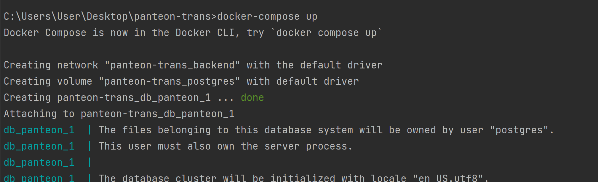
    2.1 если не запустилось и мы получили ошибку: 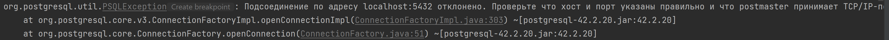
    пробуем выполнить docker volume ls и посмореть есть ли предыдущие volumes 
    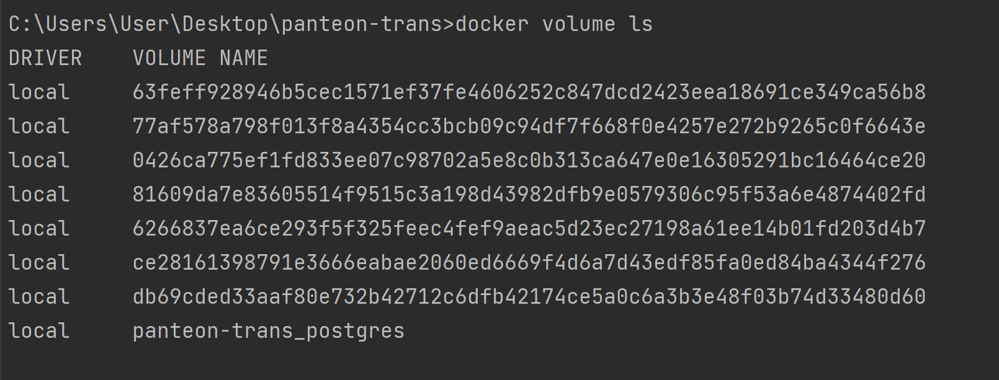
    2.2 удаляем его(их) docker volume rm volume_name 
    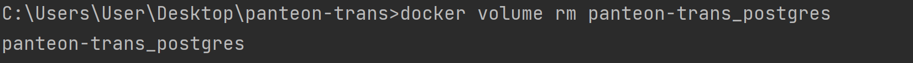
     
    2.3 повторяем docker-compose up
3. заходим в PgAdmin (если нет, устаавливаем postgresql https://www.postgresql.org/download/windows/)
    

    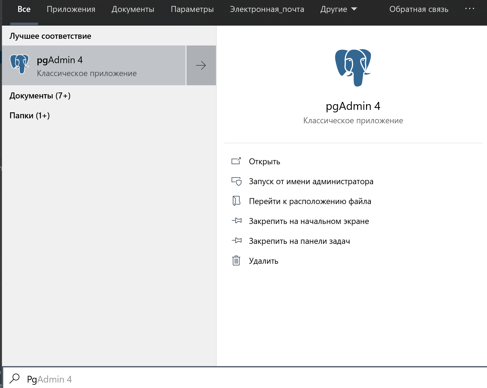

    3.1 правой клавишей мыши жмем по серверам чтобы создать новый 
    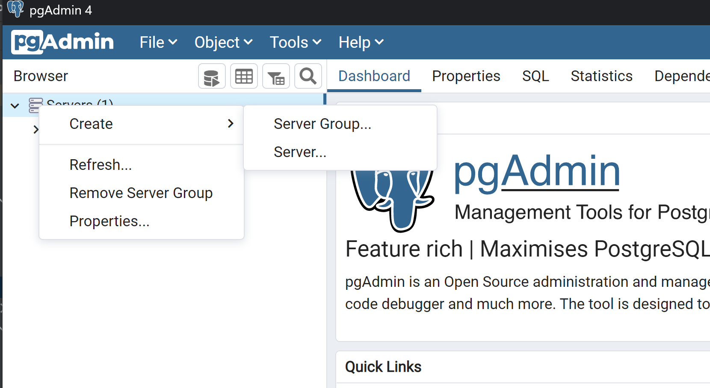
    3.2 вводим имя (любое)
   
    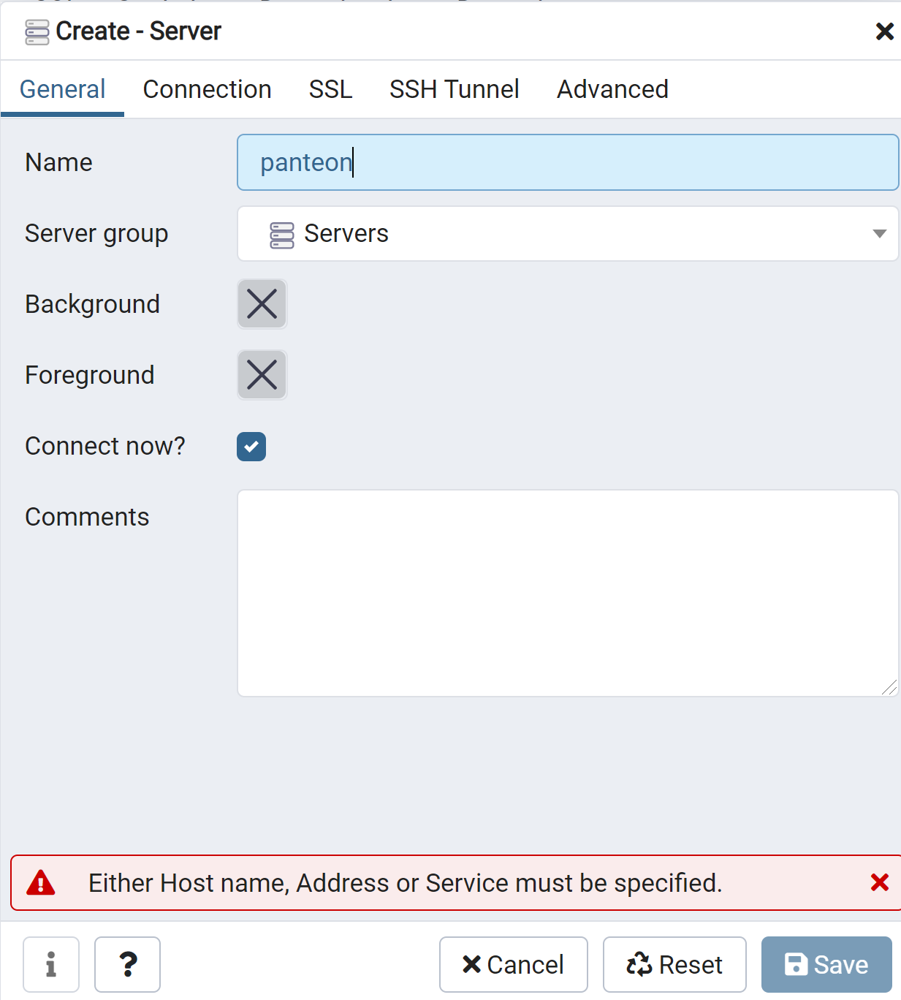
    3.3 заходим в connection и ставим hostname (на данный момент localhost, о когда перейдем на aws, тут будет ip из aws)
    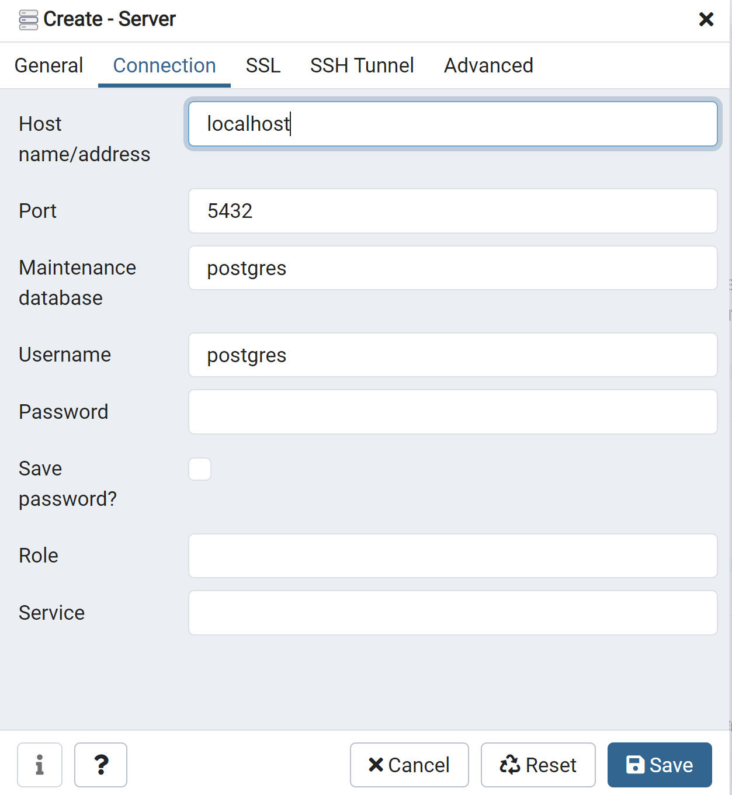
   

    3.4 вводим имя пользователя и пароль как в docker-compose.yml 
    

    
    
   

    3.5 если все правильно, получаем нашу базу 
    

    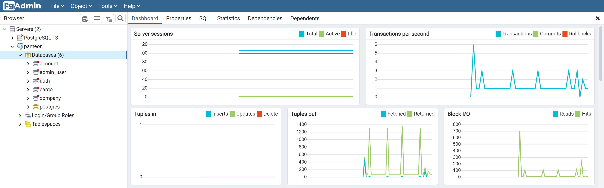
   

4. так же можем зайти в dashboard  (правой кнопкой по значку докера)
   

    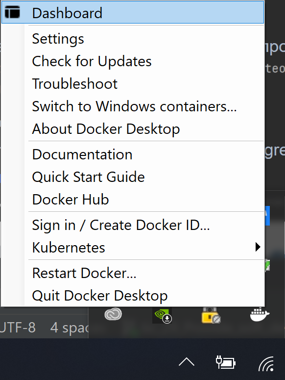 
   

   и проверить все ли хорошо.
    

    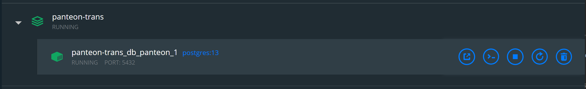
   

    если есть что-то лишнее и у нас не поднялась база, удаляем контейнер и делаем вышеперечисленные пункты
    

   
    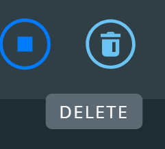
   

   

