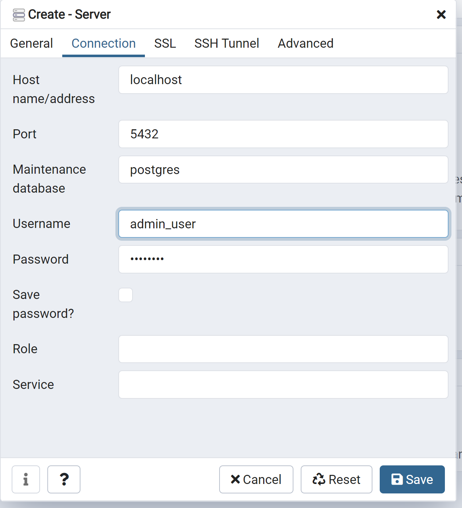

# panteon-trans
The project is represented by the transport exchange.

# Functionality

* Cargo offers table
* Transport offers table
* Company table
* Security service for us and for provided service
* Matching service for matching cargo with transport to build transportation request
* 

#Краткий экскурс

1. infrastructure-microservices-module - модуль дя конфигурации и регистрации других сервисов, в нем хранятся configApplication
   и RegistryApplication, которые необходимо запускать перед тем как запускать все остальные сервисы
2. domain-microservices-module - модуль, хранящий доменные сервисы, с которыми в основном и надо сейчас работать
    
   2.1. account-service - сервис для работы с аккаунтами, при регистрации и аутентификации он отсылает запросы на auth-service, который не доступен извне,
чтобы с ним взаимодействовать, добавляем в AuthServiceClient нужный контроллер и вызываем его в контроллере аккаунт сервиса
  
    2.2. auth-service - сервис, обеспечивающий аутентификацию и хранящий все конфигурации безопасности, чтобы взаимодействовать с ним,
   достаточно сделать метод в контроллере и клиенте другого сервиса с одинаковой сигнатурой и реагирующих на одну ссылку 

    2.3. common-data-service - сервис для работы с общими данными, такими как страны, города и регионы

    2.4. companies-service - сервис для работы с компаниями, тут реализуется логика черного список, составления рейтинга,
общая информация о компании и сотрудниках

    2.5. transport-exchange - сервис для обеспечения работы перевозок груза, отслеживания машин и информации о них

3. libs-module - модуль с общей реализацией какого-то функционала, как валидация, локализация, работа с почтой и тд.

Чтобы добавить новый модуль, устанавливаем в pom нового модуля packaging jar,

в пом модуля родителя добавляем наш новый модуль как дочерний

и в главный пом проекта добавляем зависимость на новый модуль,

новый модуль так же стоит скомпилировать

# How to run with docker?

mysql on port 3306

1. run mvn install
2. docker-compose --env-file config-files/.env up

# How to run local?

Use dev profile with all services except config service.

1. Run config service
2. Run registry service
3. Run other services

# Временно
для запуска локально сначала запускаем базу а докере (docker-compose up)

а далее запускаем сервисы локально как указано выше

! для конфиг сервиса указать profile native

! для остальных dev

# How to work with docker on Windows

1. скачиваем и устанавливаем https://www.docker.com/products/docker-desktop
2. заходим в терминал и выполняем docker-compose up  
     

    
    2.1 если не запустилось и мы получили ошибку: 
    пробуем выполнить docker volume ls и посмореть есть ли предыдущие volumes 
    
    2.2 удаляем его(их) docker volume rm volume_name 
    
     
    2.3 повторяем docker-compose up
3. заходим в PgAdmin (если нет, устаавливаем postgresql https://www.postgresql.org/download/windows/)
    

    

    3.1 правой клавишей мыши жмем по серверам чтобы создать новый 
    
    3.2 вводим имя (любое)
   
    
    3.3 заходим в connection и ставим hostname (на данный момент localhost, о когда перейдем на aws, тут будет ip из aws)
    
   

    3.4 вводим имя пользователя и пароль как в docker-compose.yml 
    

    
    
   

    3.5 если все правильно, получаем нашу базу 
    

    
   

4. так же можем зайти в dashboard  (правой кнопкой по значку докера)
   

     
   

   и проверить все ли хорошо.
    

    
   

    если есть что-то лишнее и у нас не поднялась база, удаляем контейнер и делаем вышеперечисленные пункты
    

   
    
   

   

